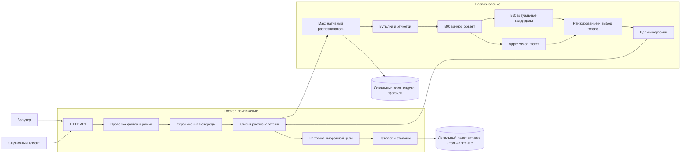

# Архитектура сканера

## Граница этой редакции

Приложение принимает фотографию, показывает найденные бутылки и карточки каталога,
позволяет выбрать цель и открыть товар на «Своё вино». В Docker работает прикладной
сервис. Модели и Apple Vision выполняются в отдельном нативном процессе на Mac.

Эта граница выбрана из-за проверенного качества существующего OCR и зависимости
Apple Vision от macOS. Она позволяет переносить интерфейс и API без изменения
распознавания. Docker-образ приложения не является образом полного ML-инференса.

Схема ML показывает обязанности компонентов, а не число вызовов: восстановление
рамок может запускать дополнительные ограниченные проходы. B0 не участвует в
рабочем визуальном ранжировании. B3 и OCR дают разные виды свидетельств.

## Код приложения

Зависимости: `http/api → application → contracts`, адаптеры подключаются при сборке
в `http.py`. `application.py` не импортирует FastAPI, файловый каталог или HTTP-клиент.
`adapters/backend.py` отвечает за транспорт модели; `adapters/assets.py` — за файлы
и карточки; `settings.py` — за конфигурацию. UI получает только `view`.
Преобразование старого ответа пока знает его поля и один исторический формат
времени; эту совместимость нужно менять вместе с контрактом нативного сервиса.

## Владение данными и решениями

| Ответственность | Владелец |
|---|---|
| Допустимость файла, размер и координаты рамки | Приложение перед отправкой в ML |
| Геометрия бутылок, признаки, OCR, порядок кандидатов | Нативный распознаватель |
| Главная/выбранная цель | Контракт целей распознавателя; приложение его сохраняет |
| Текст карточки, ссылка и изображение эталона | Проверенный локальный пакет каталога |
| Публичная форма ответа и ошибки HTTP | Приложение |
| Совместимость пакета и модели | Контрольные суммы настроек и readiness распознавателя |

Запросы не обучают модель. Приложение не подменяет ранжировщик правилами по названиям
вин. Пользовательская фотография не добавляется в галерею эталонов.

## Контракт цели

В сцене может быть несколько бутылок. Общий ответ старого распознавателя может
быть пустым, когда карточка главной бутылки уже определена. Поэтому оценочный API
читает карточку из контракта целей. Интерфейс показывает остальные бутылки отдельно.

Пример: на переднем плане «Нрав», на заднем — другая бутылка. Общий ответ сцены
может быть неоднозначным. Если распознаватель указал главную цель «Нрав», оценочный
endpoint возвращает ее slug. Если главной цели нет, приложение не выдумывает ее.

Число сходства не переводится в проценты уверенности. Неизвестные поля не
заполняются фиктивными значениями. Внешний ответ не содержит полного внутреннего
отчета модели, путей к фото и экспериментальных журналов.

## Развертывание и отказ

Один процесс приложения и один нативный процесс распознавания достаточны для
локального выпуска. Очередь ограничивает нагрузку на модель. Отдельные базы данных,
брокер сообщений и микросервисы для этапов модели здесь не нужны.

Настройки задаются окружением. Локальные активы подключаются только для чтения;
контрольные суммы проверяются до готовности приложения. Недоступный распознаватель
или несовпадение версии не заменяются результатами другой модели. Liveness означает
живой HTTP-процесс; readiness дополнительно проверяет готовность зависимости.

## Следующая граница рефакторинга

Нативный исследовательский runtime пока связан с конструкторами прошлых выпусков,
исходными контрольными суммами и проверками происхождения данных. Перенос его в
плоский самостоятельный пакет — отдельная миграция. Она должна сохранить алгоритмы,
параметры, все нужные активы и ответы на контрольных фотографиях.

Нельзя считать удаление этих проверок сохранением воспроизводимости. Сначала нужен
экспорт фактически собранных компонентов и новый манифест файлов, затем сборка без
исторических конструкторов и сравнение целей, рамок и кандидатов. До такой проверки
выпуск использует действующий Mac-распознаватель.
