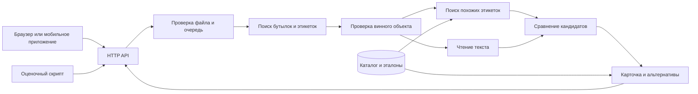

# Как устроен сканер

Сервис превращает фотографию бутылки или винной полки в карточки товаров каталога
«Своё вино». Поиск по изображению и чтение текста дополняют друг друга:
оформление этикетки помогает найти похожие товары, надписи помогают их различить.

## Путь фотографии

1. **Поиск объектов.** Детекторы находят бутылки и этикетки, связывают этикетку с
   бутылкой. Классификатор отсеивает объекты, не похожие на вино.
2. **Поиск по изображению.** Модель преобразует этикетку в числовые признаки.
   По ним индекс находит похожие эталонные изображения каталога.
3. **Чтение текста (OCR).** Система читает название, производителя, сорт и другие
   видимые надписи. Эта ветка работает независимо от поиска похожих изображений.
4. **Выбор товара.** Ранжировщик упорядочивает кандидатов по сходству изображения
   и совпадению текста, учитывая расхождения между вариантами вина.
5. **Ответ.** API добавляет характеристики, эталон и ссылку из каталога.
   Для нескольких бутылок интерфейс показывает отдельные карточки.

## Модули и ответственность

| Модуль | Назначение |
|---|---|
| `wine_scanner/` | Веб-интерфейс и API, проверка входа, очередь, сборка публичной карточки |
| `recognizer/` | Поиск объектов, признаки изображений, чтение текста и выбор товара |
| `wine_scanner_core/` | Запуск распознавателя на Linux CPU и проверка совместимости моделей и данных |
| Внешний пакет моделей и каталога | Веса, поисковый индекс, эталоны и характеристики товаров |

В шлюзе зависимости направлены `http/api → application → contracts`.
`application.py` содержит прикладную логику без зависимости от FastAPI.
`adapters/backend.py` отправляет запросы распознавателю, `adapters/assets.py`
читает карточки и миниатюры. `settings.py` получает настройки из окружения.
Интерфейс работает с публичным объектом `view`, описанным в [API](docs/API.md).

Шлюз отвечает за запрос и форму ответа. Распознаватель отвечает за рамки,
главную бутылку и порядок кандидатов. Сведения о товаре принадлежат каталогу.
Во время пользовательского запроса модель не обучается, фото не добавляется в эталоны.

## Два варианта исполнения

| Вариант | Чтение текста | Вычисления | Подключение |
|---|---|---|---|
| Docker на Linux | PP-OCRv6 Medium | CPU, 2 потока | `gateway-linux` и `core` |
| Распознаватель на macOS | Apple Vision | Ускорение Metal (MPS) | Шлюз `gateway` к подготовленному процессу |

Модели сравнения изображений, каталог и логика выбора товара общие.
Публичный API использует Apple Vision. Docker позволяет запустить систему целиком
на Linux. Порядок запуска — в [README](README.md), технические детали Linux — в
[CORE](docs/CORE.md), измеренное сравнение — в [QUALITY](docs/QUALITY.md).

## Несколько бутылок на фото

У каждой найденной бутылки свой идентификатор, рамка и набор кандидатов.
`POST /api/recognize` возвращает все карточки для интерфейса.
`POST /v1/eval/predict` возвращает `slug` главной бутылки или бутылки, явно выбранной
рамкой `target_roi`. Если главная цель не определена, возвращается `null`.
Slug — идентификатор товара в каталоге, а не свободное текстовое описание.

Например, на полке видны три бутылки. Веб-интерфейс позволяет выбрать любую,
а оценочный endpoint должен вернуть один ответ по правилу выбора главной цели.

## Эксплуатация

Один процесс шлюза обслуживает один процесс распознавателя. Очередь допускает
один выполняющийся запрос и до двух ожидающих. `health/live` проверяет HTTP-процесс,
`health/ready` — готовность распознавателя и совместимость пакета данных.

Модели и каталог подключаются только для чтения. На старте проверяются контрольные
суммы файлов и версии компонентов. Это защищает от случайного смешивания модели
с чужим индексом или каталогом. Технический идентификатор такой комбинации
называется **профилем**.

Контейнеры работают без root, с файловой системой только для чтения. Порты по
умолчанию доступны на `127.0.0.1`. Для внешнего доступа нужны HTTPS, авторизация
и ограничения нагрузки. Недоступность модели возвращается как ошибка API.
