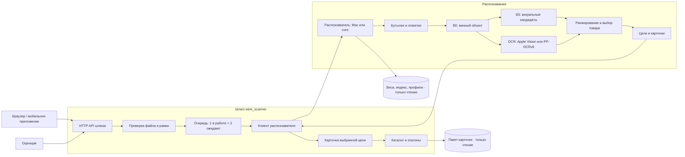

# Архитектура сканера

## Состав

Сканер состоит из двух частей с явной границей:

- **Шлюз `wine_scanner`** — HTTP API и веб-интерфейс. Проверяет файл и рамку,
  держит ограниченную очередь, превращает ответ распознавателя в публичную
  карточку, отдаёт эталоны и ссылки из локального пакета каталога.
- **Распознаватель** — модели и OCR. Находит бутылки и этикетки, собирает визуальные
  и текстовые свидетельства, ранжирует товары каталога и возвращает цели сцены.

Распознаватель есть в двух исполнениях с одинаковыми весами, галереей и ранжированием:

| Исполнение | OCR | Устройство | Шлюз |
|---|---|---|---|
| Нативный процесс на macOS (`:8175`) | Apple Vision | MPS | `gateway` |
| Контейнер `core` (`wine_scanner_core`, `:8375`) | PP-OCRv6 Medium | CPU, 2 потока | `gateway-linux` |

Публичный сервис vines.aiweapps.com использует Mac-исполнение. Контейнерное позволяет
запустить сканер целиком на Linux без Mac.

Схема показывает обязанности, а не число вызовов: восстановление рамок может
запускать дополнительные ограниченные проходы. B0 только отсеивает невинные объекты
и не участвует в визуальном ранжировании. B3 и OCR дают независимые свидетельства.

## Код шлюза

Зависимости направлены `http/api → application → contracts`; адаптеры подключаются
при сборке в `http.py`. `application.py` не импортирует FastAPI, файловый каталог
и HTTP-клиент. `adapters/backend.py` — транспорт к распознавателю,
`adapters/assets.py` — файлы и карточки, `settings.py` — конфигурация из окружения.
Интерфейс получает только `view`.

## Владение данными и решениями

| Ответственность | Владелец |
|---|---|
| Допустимость файла, размер, координаты рамки | Шлюз до отправки в модель |
| Геометрия бутылок, признаки, OCR, порядок кандидатов | Распознаватель |
| Главная и выбранная цель | Контракт целей распознавателя; шлюз его не меняет |
| Текст карточки, ссылка, изображение эталона | Проверенный пакет каталога |
| Публичная форма ответа и ошибки HTTP | Шлюз |
| Совместимость пакета и модели | Контрольные суммы в настройках и readiness распознавателя |

Запросы не обучают модель, фото не попадают в галерею. Шлюз не подменяет
ранжировщик правилами по названиям вин.

## Контракт цели

В сцене может быть несколько бутылок. Общий ответ сцены бывает неоднозначным, даже
когда главная бутылка определена, поэтому оценочный endpoint берёт карточку из
контракта целей. Остальные бутылки интерфейс показывает отдельно.

Пример: на переднем плане «Нрав», на заднем — другая бутылка. Если распознаватель
указал главной целью «Нрав», `/v1/eval/predict` вернёт его slug. Если главной цели
нет, шлюз её не выдумывает и возвращает `null`.

Сходство не переводится в проценты уверенности, неизвестные поля не заполняются.
Внешний ответ не содержит внутреннего отчёта модели и путей к файлам.

## Развёртывание и отказ

Одного процесса шлюза и одного процесса распознавателя достаточно; очередь
ограничивает нагрузку на модель. Отдельные базы, брокеры и микросервисы для этапов
модели не используются.

Настройки задаются окружением. Пакеты активов подключаются только для чтения, их
контрольные суммы проверяются до готовности. Недоступный распознаватель или
несовпадение профиля не заменяются ответом другой модели. Liveness означает живой
HTTP-процесс, readiness — готовность распознавателя с ожидаемым профилем.

Контейнеры работают без root, с read-only файловой системой и без capabilities.
Порты публикуются только на 127.0.0.1; `gateway-linux` разделяет сетевое пространство
`core`. Модели читают только локальные файлы, но полная сетевая изоляция контейнеров
не заявляется.

## Перенос распознавателя в Linux

`recognizer/` — байтовые копии serving-кода исходного проекта; `SOURCES.json` хранит
их SHA-256 и происхождение. Ядро собирает этот код без переписывания и на старте
заменяет только исполнение: MPS → CPU, Apple Vision → PP-OCRv6. Каждая замена
видна в `/v1/core`. Проверки происхождения, которым нужны закрытые обучающие данные,
выполнены при выпуске пакета и записаны в его квитанцию. Подробности — [CORE](docs/CORE.md).

Сборка в плоский пакет без исторических конструкторов — отдельная будущая миграция:
она должна сохранить алгоритмы, параметры, активы и ответы на контрольных фото.
